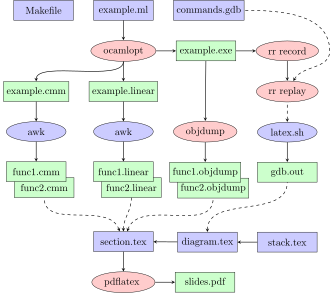

# OCaml behind the scenes: exceptions

Sources of the slides and examples from the 'tech talk' that was held on 2022-11-18, at Tarides in Paris. The recording is now available on [watch.ocaml.org](https://watch.ocaml.org/w/vur2uhCFTZWQfDfkcbCPfC).
This version of the slides also includes the 'Backtraces' section and 'The default handler' as a bonus one, which were not covered in the original talk due to time constraints.

Rendered slides can be found in the [releases](https://github.com/fabbing/obts_exn/releases/).

The goal of this presentation is to explain the implementation of OCaml exceptions in native code. What happens at the lowest level when an exception is raised and subsequently caught? It is often claimed that OCaml exceptions are particularly fast, how is this achieved?

# Outline

* Assembly
  * x86-64 asssembly
* Catching exceptions
  * Exceptions are values
  * Exception handlers
  * Installing a trap
  * Removing a trap
  * Raise
* Nested handlers
  * Multiple handlers, multiple traps
  * Raise and reraise
* Backtraces
  * One advantage of raising with debugging information
  * The multiple kinds of raise
* Bonus: Default handler
  * Runtime's default exception handler

# Building

## Commands
```sh
make ocaml
make sources
make presentation
```

## Dependencies
* pdflatex (packages: Beamer, Minted, TikZ, xstring, xint)
* python pygments
* rr, gdb
* objdump
* awk, sed
* make

## Build graph

